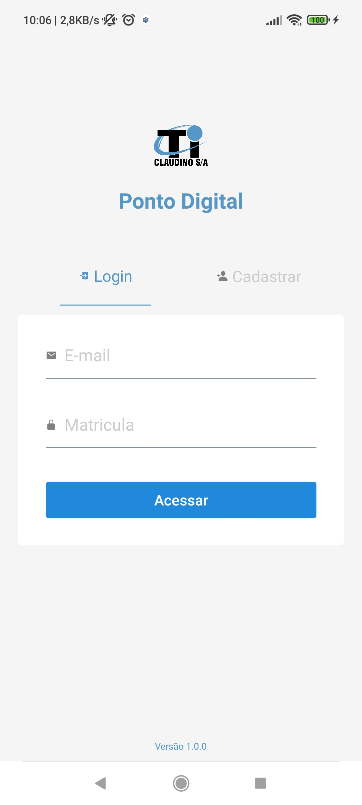

# Preview do app

<h1>Registro de ponto digital <h1>
<h2>Funcionalidades:</h2>
<h3>Aplicativo com a finalidade de registrar os pontos dos funcionarios remotamente. O aplicativo conta com localização geografica, Verificação de localização, identifica localizações falsas, bloqueia fake gps, registro em tempo real no banco de dados e no celular.</h3>

 

 

